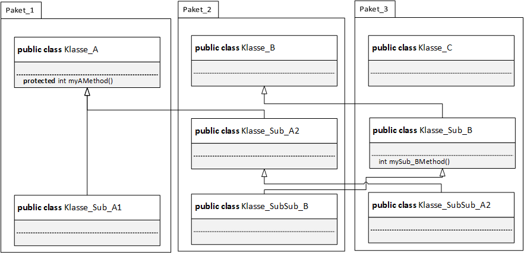

# Objektinstanziierung
1. Gegeben sei folgende Vererbungshierachie in der Form eines UML-Diagramms:

- Hinweis: Für die Kapselung wurde in dem UML-Diagramm jeweils die zugehörige Syntax aus der Sprache Java verwendet.
- Geben Sie für jede der acht angegebenen Klassen an, ob sie jeweils auf die Methode `myAMethod()` bzw. `my_SubBMethod()` zugreifen kann.
---
### Zu 1.:
- Klasse `Klasse_A`: Zugriff auf _myAMethod()_
- Klasse `Klasse_Sub_A1`: Zugriff auf _myAMethod()_
- Klasse `Klasse_B`: weder noch
- Klasse `Klasse_Sub_A2`: Zugriff auf _myAMethod()_
- Klasse `Klasse_SubSub_B`: *kein* Zugriff auf _mySub_BMethod()_
- Klasse `Klasse_C`: weder noch
- Klasse `Klasse_Sub_B`: Zugriff auf _mySub_BMethod()_
- Klasse `Klasse_SubSub_A2`: Zugriff auf _myAMethod()_