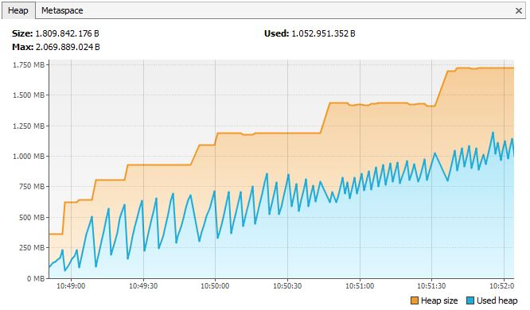

# Garbage Collection
1. Die nachfolgende Klasse Message erzeugt Nachrichten, von denen eine auf der Konsole ausgegeben wird:
```java
import java.util.ArrayList;
import java.util.List;

public class Message {
    private static List<Message> messageCache = new ArrayList<>();
    private static int count = 0;
    private String msg;

    public Message(String txt) {
        count++;
        this.msg = String.format("Msg (#%d) %s",count,txt);
    }

    public void putInCache() {
        messageCache.add(this);
    }

    public void writeMessage() {
        System.out.println(this.msg);
    }

    public static Message getMessage(int index) throws Exception {
        if (index < 0 || index > messageCache.size()) {
            throw new Exception("Message is not in cache any more. Please load it from disk!");
        }

        return messageCache.get(index);
    }

    public static void main(String... args) {
        for (int i = 0; i < 10_000_000; i++){
            // message received here
            Message msg = new Message("test");
            msg.putInCache();
        }

        try {
            Message.getMessage(42).writeMessage();
        } catch (Exception e) {
            System.out.println(e.toString());
        }
    }
}
```
- Beim Analysieren der Speicherverwendung des Programms stellten die Entwickler aber folgendes Bild fest:

- Welche Probleme im Code verursachen dieses Verhalten und wie würden Sie dies lösen?
- **Hinweis**: Die immer kleiner werdende Zick-Zack-Bewegung des verwendeten Heap-Speichers zeigt, dass die Garbage-Collection aktiv ist, jedoch nicht den Speicher komplett bereinigen kann.
---
### Zu 1.:
- Klasse speichert Nachrichten-Texte in dynamischer Datenstruktur -> Array ist speichereffizienter, weniger Overhead
- Array sollte zu Beginn mit benötigter Größe initialisiert werden