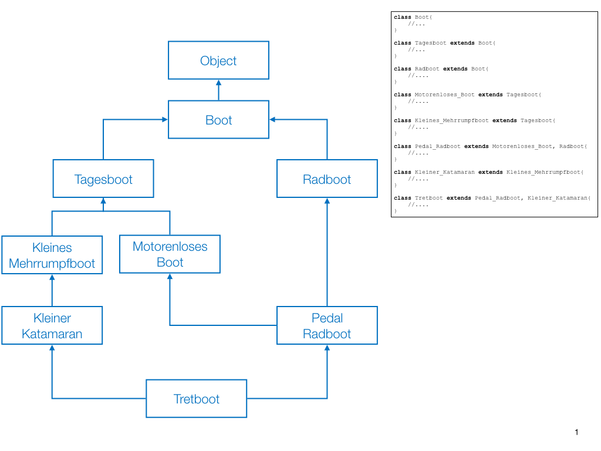

# Linearisierung
1. Mehrfachvererbung kann das Problem verursachen, dass eine erbende Klasse nicht entscheiden kann, welche konkrete Implementierung einer geerbten Methode verwendet werden soll (Diamond Problem). Eine mögliche Lösung ist die Linearisierung, die den Vererbungsgraph mittels topologischer Sortierung von spezifischer zu unspezifischer Klasse in eine eindeutig sortierte Liste umwandelt. Dadurch kann die erbende Klasse eindeutig entscheiden, welche Methode aufgerufen werden soll.
- Gegeben sei folgender Vererbungsgraph mit zusätzlicher Angabe der Vererbungsdeklaration im Quellcode:

- Erstellen Sie anhand der drei in der Vorlesung vorgestellten Regeln zur Linearisierung mit der lokalen Vererbungsreihenfolge eine Linearisierung für die Klasse Tretboot.
---
### Zu 1.:
- ...